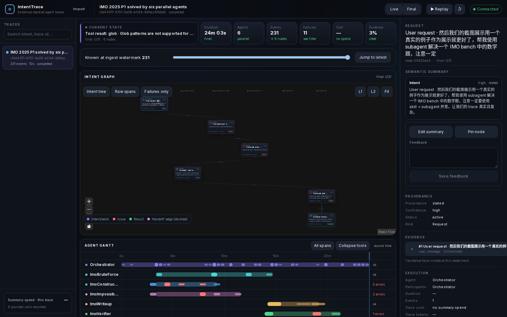
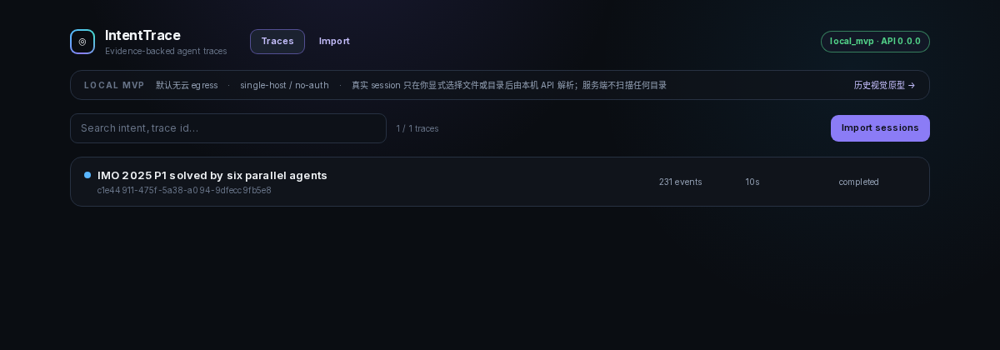

# IntentTrace

[](https://github.com/chivier/IntentTrace/actions/workflows/ci.yml)
[](LICENSE)
[](.node-version)
[](docs/contracts/api/openapi.yaml)

IntentTrace 是一个本地优先的 Agent 可观测性工作台：它把多智能体执行事件整理为可回放、可验证、由证据支撑的 Intent Graph，同时始终保留不可变的原始执行事实。

> **项目阶段：Local MVP。** 当前面向开发者控制的单机环境，无认证、非多租户、非 HA；唯一宿主入口绑定 `127.0.0.1`。云模型默认关闭，mock semantic pipeline 可在完全本地的环境中运行。



## 为什么使用 IntentTrace

- **原始事实不可变**：raw execution events 只追加，不被模型输出覆盖。
- **语义结论可追溯**：每条 claim 都能回到 raw event 或 artifact evidence。
- **按当时信息回放**：Graph、Gantt、Raw Events 和 Evidence 共用 ingest watermark。
- **确定性提交边界**：LLM 只能提出 proposal；Zod 校验与 deterministic reducer 决定是否提交 revision。
- **多种导入方式**：支持 canonical JSONL、OTLP HTTP JSON/gzip，以及显式路径的 Codex/Claude session 导入。
- **本地优先与故障可降级**：provider 不可用时，raw trace 和 evidence 路径仍然可用。
- **人工修订**：支持 edit、pin、feedback，并保留 immutable revision history。

## 界面

合成 trace 的本地入口展示搜索、运行状态与部署边界：



README 截图只包含固定 seed 的合成 fixture。栈启动并运行 `pnpm demo:load` 后，可用 `pnpm screenshots:readme` 复现；脚本会过滤本地其他 trace，避免真实 session 进入截图。

## 快速开始

### 环境要求

- Linux x86_64（当前已验证的 Compose 目标）
- Node.js `24.18.1` 与 Corepack
- pnpm `11.18.0`
- Docker Engine 与 Docker Compose v2

macOS 12+ 可使用 Docker Desktop；Tauri DMG 尚需 Apple codesign/notarization 才能作为正式分发产物。Windows 尚未列为验证平台。

### 启动本地演示

```bash
corepack enable
corepack prepare pnpm@11.18.0 --activate
pnpm install --frozen-lockfile
pnpm docker:up
pnpm demo:load
pnpm docker:url
```

打开 `pnpm docker:url` 输出的 `/traces`。`demo:load` 使用固定 seed，重复运行是幂等的。

默认只有 Web 映射到自动分配的 `127.0.0.1` 临时端口；API、PostgreSQL 与 worker 仅在 Compose 私有网络中可达。整栈只有两个镜像：`postgres`，以及 api/worker/web/migrate 四个服务共用的同一个应用镜像。需要固定 Web 端口时：

```bash
INTENTTRACE_WEB_PORT=13000 pnpm docker:up
```

常用运维命令：

```bash
pnpm docker:status   # 查看服务健康状态
pnpm docker:url      # 查询当前动态 Web 地址
pnpm docker:down     # 停止服务，保留 named volumes
```

## 导入 Trace

Collector 只读取操作者通过 `--path` 明确指定的文件或目录，拒绝 symlink 边界。目录导入会递归查找 `.jsonl`/`.ndjson`，采用“先发现、再选择”的两阶段流程；真实 session、`.env`、数据库 dump 和 artifact volume 不应提交到 Git。

```bash
WEB_ORIGIN="$(pnpm --silent docker:url | awk '/IntentTrace Web:/ { print $3 }')"

# 1. 发现最近会话：不发送数据，默认不把 prompt 正文写到 stdout
pnpm --filter @intenttrace/collector dev discover \
  --source codex \
  --path ~/.codex/sessions \
  --limit 50

# 如确实需要人工辨认内容，显式选择 bounded visible previews
pnpm --filter @intenttrace/collector dev discover \
  --source codex \
  --path ~/.codex/sessions \
  --limit 50 \
  --include-previews

# 2. 从 catalog 复制 opaque id；--session 可重复
SESSION_ID_1="paste-24-character-catalog-id"
SESSION_ID_2="paste-24-character-catalog-id"
pnpm --filter @intenttrace/collector dev import \
  --source codex \
  --path ~/.codex/sessions \
  --session "$SESSION_ID_1" \
  --session "$SESSION_ID_2" \
  --api "$WEB_ORIGIN"

# 仍可批量导入 Claude 的最近会话
pnpm --filter @intenttrace/collector dev import \
  --source claude \
  --path ~/.claude/projects \
  --newest \
  --max-files 20 \
  --api "$WEB_ORIGIN"
```

Catalog 不输出绝对/相对路径、文件名或 native session ID；opaque ID 会随候选文件变化而失效，避免旧 preview 静默导入新内容。实际 import 只允许发送到 loopback API。真正导入前，每个文件会用 no-follow file handle 完整 parse/Zod preflight，坏文件发送 0 个 raw facts；默认单文件上限为 64 MiB，可通过 `--max-file-mib` 显式调整。Collector 会在 adapter 层移除 Codex reasoning/encrypted blocks、Claude thinking/signature，以及内部 world-state/file-history snapshots；详见[导入体验调研](docs/design/import-experience-research.md)与[数据处理策略](docs/security/data-handling.md)。

## 架构概览

```text
Explicit files / OTLP
        │
        ▼
Collector + adapters ──► Web loopback proxy ──► API ──► PostgreSQL raw facts
                                                   │              │
                                                   │              └─► durable SSE/outbox
                                                   ▼
                                          summary_jobs worker
                                                   │
                                      proposal → Zod → reducer
                                                   │
                                                   ▼
                                       immutable semantic revisions
                                                   │
                                                   ▼
                                     Graph / Gantt / Evidence UI
```

核心边界：

1. Zod schema 是领域契约的 authoring source；Drizzle schema 与 migrations 是持久化 source。
2. Raw event 是 append-only fact，semantic graph 是 revisioned derived data。
3. user intent、agent intention、observed action 与 outcome 分开建模。
4. provider 只返回 proposal；deterministic reducer 校验并提交。
5. 系统不重建、存储或展示隐藏 chain-of-thought。

详细设计见[架构概览](docs/architecture/overview.md)、[数据流](docs/architecture/data-flow-and-sequences.md)与 [ADR 索引](docs/architecture/adr/README.md)。

## 仓库结构

```text
apps/
  api/          Fastify API、SSE 与 OpenAPI
  collector/    JSONL / OTLP / Codex / Claude 导入
  desktop/      Tauri 2 macOS launcher
  web/          Next.js trace workbench
  worker/       PostgreSQL 作业表驱动的语义 pipeline
packages/
  schema/       Zod domain schemas 与生成 JSON Schema
  db/           Drizzle schema、migrations、repositories
  adapters/     source adapters 与隐私边界
  intent-reducer/ deterministic semantic reducer
  graph-layout/ ELK layout 与 agent lanes
  storage/      content-addressed artifact storage
docs/           架构、契约、安全、运维与项目证据
```

完整导航见 [`docs/README.md`](docs/README.md)。

## 开发与验证

```bash
pnpm format:check
pnpm lint
pnpm typecheck
pnpm test
pnpm test:contract
pnpm test:e2e
pnpm build
pnpm docs:check
pnpm schema:check
```

CI 还会运行 production dependency audit、Compose 静态检查和两次 migration，以验证 migration 可重复执行。贡献前请阅读 [`CONTRIBUTING.md`](CONTRIBUTING.md) 与 [`AGENTS.md`](AGENTS.md)。

## 安全与隐私

IntentTrace 当前**没有认证**，请勿把服务暴露到不可信网络。provider egress 默认关闭；启用真实 provider 需要显式 mode、allowlist、预算、超时与 redaction gate。不要在公开 Issue 中粘贴 API key、真实 trace payload、session log 或私有源码。

漏洞请按 [`SECURITY.md`](SECURITY.md) 私下报告；一般使用问题见 [`SUPPORT.md`](SUPPORT.md)。

## 当前限制

- 当前发布边界是 local single-host MVP；不支持 auth/RBAC、多租户、HA 或 public SaaS。
- OpenAI/DeepSeek adapter 已实现，但真实 provider 质量与费用尚未完成公开 release qualification。
- 性能数据目前是 synthetic smoke 和单机观测，不是生产 SLA。
- macOS universal DMG workflow 已具备；正式产物仍需 Apple 签名、公证和安装验证。
- OTLP gRPC、run comparison、移动端等仍在范围外。

已实现/已验证/阻塞项的严格证据见 [`docs/project/progress.md`](docs/project/progress.md) 和 [`docs/project/release-readiness.md`](docs/project/release-readiness.md)。

## 参与贡献

欢迎 Bug 报告、文档改进、adapter fixture、可访问性修复和小范围 PR。行为或契约变更应同步更新 schema、migration、OpenAPI、测试与文档；模型输出不能直接覆盖 raw facts。提交贡献即表示该贡献按项目许可证提供，详见 [`CONTRIBUTING.md`](CONTRIBUTING.md)。

## 许可证

IntentTrace 采用 [GNU Affero General Public License v3.0 only](LICENSE)（SPDX：`AGPL-3.0-only`）。如果你修改本项目并通过网络向用户提供服务，AGPL 第 13 节要求向这些用户提供对应源代码。第三方依赖与自托管 Inter 字体保留各自许可证；分发或部署前请复核 [`THIRD_PARTY_NOTICES.md`](THIRD_PARTY_NOTICES.md) 及对应依赖许可文本。
