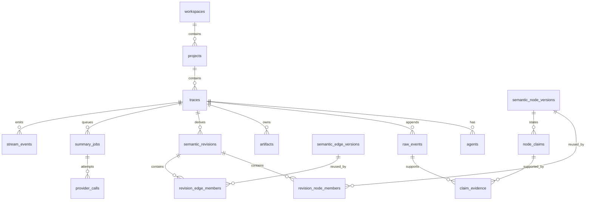

# 数据库

本文合并 ERD、schema 不变量、migration 策略与 retention/删除规则。列、索引、FK 与 enum 的事实源始终是 `packages/db/src/schema.ts` 和已提交 migration。

## 数据库 ERD

_来源文档标记 `normative: false`：下图仅帮助阅读，不构成规范约束。_

图仅帮助阅读；列、索引、FK 与 enum 的事实源是 `packages/db/src/schema.ts` 和已提交 migration。

## Schema 不变量

`raw_events(trace_id, ingest_seq)` 与 source identity 唯一；raw 表由数据库 trigger 拒绝 UPDATE/DELETE。`traces.next_ingest_seq` 只能在 ingest transaction 内锁行递增。Artifact 在 trace 内 hash 唯一。

Revision 在 trace/branch/sequence 唯一；membership 以 revision + logical ID 为主键，且 version immutable。Revision 的内容字段不可更新；`stale` 是唯一允许的生命周期迁移，并且只能由数据库触发器接受 `false → true`。Claim ordinal 在 node version 内唯一，evidence FK 指向 raw event。Summary nonce 唯一，trace + input hash 唯一。Stream event 使用全局递增 bigint ID，trace + ID 有索引。

应用必须额外验证同一 trace 归属、hash 格式、branch parent 与 graph cycle；数据库约束是最后防线而非 reducer 替代。删除 raw/revision 相关 FK 默认 restrict，执行 trace deletion workflow 时才按明确顺序处理。

## Migration 策略

Drizzle schema 变更先执行 `pnpm db:generate`，审阅生成 SQL、锁类型、默认值、回滚/恢复影响，再提交 schema 与 migration。CI 运行 `drizzle-kit check`；发布路径在空 PostgreSQL 18.4 上 migrate 两次，第二次必须 no-op。

禁止在应用启动进程中隐式生成 migration。Compose 用一次性 `migrate` 服务，成功后 API/worker 才启动。生产化前的破坏性变更采用 expand → backfill → switch → contract；大表 backfill 必须可分批、可观测、可中断。

Migration 不承诺自动 down；恢复策略是先备份/验证 restore，再 rollout。已经在共享环境执行的 migration 不改写，修正必须增加下一 migration。

## Retention 与删除

MVP 不自动过期 trace、outbox 或失败 job，默认由本地 operator 决定保留期；provider request/response 正文不落库，只有 hash、token/cost 和 redaction report。自动 retention 留到有稳定容量数据之后，避免静默丢失 replay cursor。

`DELETE /api/v1/traces/:traceId?confirm=:traceId` 要求精确 ID 确认；repository 在单事务中按 FK 顺序删除 feedback/provider audit/jobs/evidence/membership/versions/outbox/revisions/artifacts/raw/agents/trace，再调用 `ArtifactStore.deleteTrace` 清理 volume。若 volume 清理失败，数据库删除已完成且会留下可识别 orphan 文件；operator 按 runbook 重试。

备份是延迟删除副本；文档化的 backup expiry 到期前不能声称物理彻底删除。任何真实用户数据进入测试 fixture 前必须匿名化并人工审阅。
