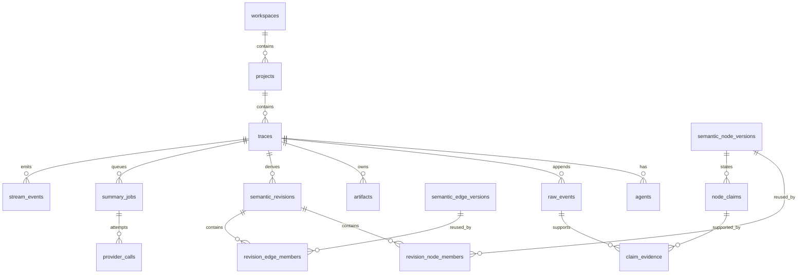

# 数据库 ERD

```mermaid
erDiagram
  workspaces ||--o{ projects : contains
  projects ||--o{ traces : contains
  traces ||--o{ agents : has
  traces ||--o{ raw_events : appends
  traces ||--o{ artifacts : owns
  traces ||--o{ semantic_revisions : derives
  semantic_revisions ||--o{ revision_node_members : contains
  semantic_revisions ||--o{ revision_edge_members : contains
  semantic_node_versions ||--o{ revision_node_members : reused_by
  semantic_edge_versions ||--o{ revision_edge_members : reused_by
  semantic_node_versions ||--o{ node_claims : states
  node_claims ||--o{ claim_evidence : supported_by
  raw_events ||--o{ claim_evidence : supports
  traces ||--o{ summary_jobs : queues
  summary_jobs ||--o{ provider_calls : attempts
  traces ||--o{ stream_events : emits
```

图仅帮助阅读；列、索引、FK 与 enum 的事实源是 `packages/db/src/schema.ts` 和已提交 migration。
